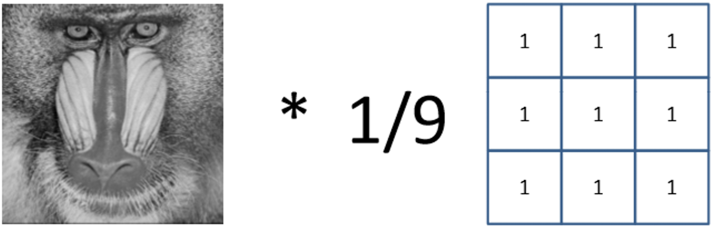
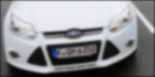
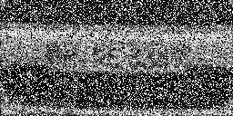
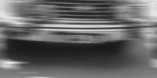
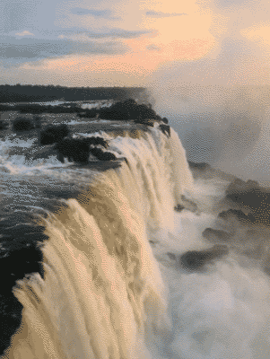
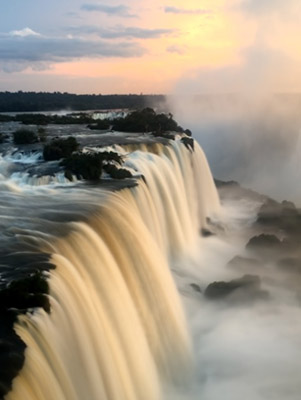
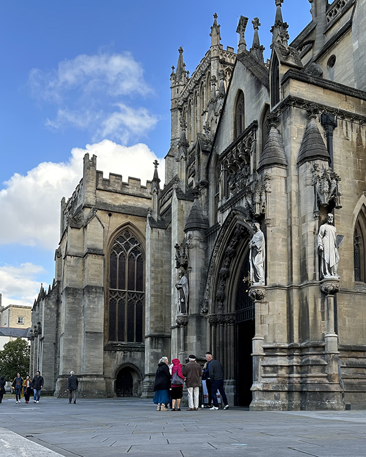
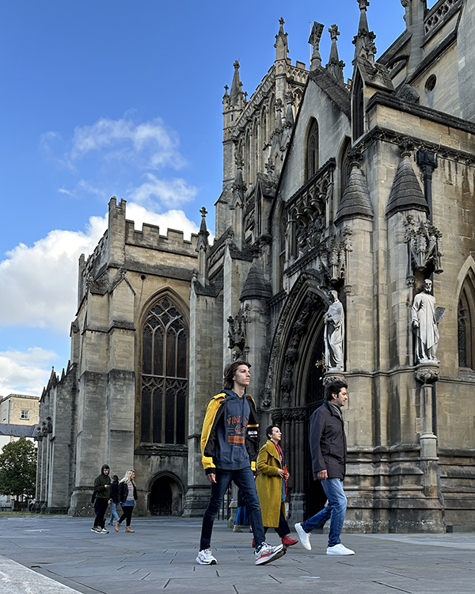
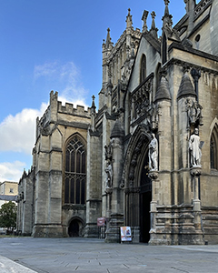

# Lab 2: The Number Plate Challenge: Convolution, Filtering and Enhancement

> We run our labs with [Python 3.6+](https://www.python.org/downloads/).
> For Windows, you might want to use [Conda](https://www.anaconda.com/products/distribution).

## Using the lab sheet

> You can also follow the instructions below using [the lab sheet](Lab2sheet.pdf).

> Example code and images referred to in the instructions are in the `python` and `images` folders, respectively.

## Task 1: Convolution Basics

1. Your first task is to write a small program that performs convolution between an input image (e.g. the mandrill image) and a kernel image (e.g. the simple 3x3 image given below).
2. Implement the convolution function yourself by accessing pixels – for the moment ignore the OpenCV commands that can perform convolution. The operation is so fundamental to image processing that you should write it yourself at least once.
3. Test your program on the mandrill image and the kernel below. What can you say about the output produced? Why do we need the factor 1/9?
4. Play around with the kernel values and see what effect it has on the image. Try a set of values that will sharpen the image.

    
Hint1

    
Hint2

Check high-pass filtering in Lecture 03 - Filtering in Spatial Domain, page 8 Spatial Low/High Pass Filtering

# The Number Plate Challenge

**Introduction**:
Image filtering techniques have a wide field of application. For instance, the compensation of image defects/corruption, also known as ‘image restoration’, which is one of many key areas where filtering is applied to solve problems in the real world. In this lab task you will use classical filtering techniques to enhance or recover seemingly ‘lost’ image information of interest.

**Overview**:
In particular, your task will be to recover number plate information from corrupted imagery by applying image filters in OpenCV that counter-act the corruptive processes (e.g. blur, noise) that the images have undergone. There are many ways to implement filters, if you want some inspiration from first principles, have a look at the code examples provided on the unit webpage to help you along…

## Task 2: Recovery by Sharpening

- The first number plate image has been captured by a camera that is slightly out of focus resulting in blur.
- Your first task is to implement sharpening using OpenCV (for instance by modifying the provided filtering code) to recover the number plate.
- Consider sharpening your image by adding the image to itself and subtracting a blurred version of it (i.e. perform **unsharp masking**).  Why and how does this technique work?
- Make sure you avoid out-of-range problems and range shifts, since convolution may produce negative values and large ranges!
- What effect do different kernel sizes and/or multiple rounds of filtering have on the number plate readability?
- You won’t get a perfectly sharp image, but should aim at arriving at a sharpened image where the number is clearer than in the original.

    
Hint

$I_\text{Sharpen} = I_\text{Original} + \alpha \left(I_\text{Original} - \text{Smooth}(I_\text{Original})\right)$

(See Lecture 03 - Filtering in Spatial Domain:  Sharpening</a>).

## Task 3: Recovery by Median Filtering

- The second number plate was captured on film material of very poor quality resulting in ‘salt and pepper’ noise.
- Your task is to implement a median filter to recover the number plate information.
- A median filter operates by replacing a pixel with the median of ‘its neighbouring pixels and the pixel itself’.
- What influence does the size of the pixel neighbourhood have (e.g. 8 adjacent pixels, 24 neighbouring pixels) on the number plate readability?

## Task 4: OPTIONAL: Recovery by De-Convolution

- This task is optional and advanced, it should be attempted only if you who have finished task 1 and 2 fully.
- The third number plate is distorted by motion blur.
- To recover the number plate you may want to use **Wiener Deconvolution**.
- First, familiarise yourself with the idea of this filter (see below).
- We have provided you with a Wiener deconvolution function in `python/deconvolution.py`.
- You need to experiment with the blur length, blur angle and signal to noise ratio to try and get a good reconstruction.
- Have a close look at the blurred image to help you estimate these parameters.

    
Hint

Adjust this function call `recover = WienerDeconvoluition(gray_image,15,3,0.001,0)`

### Wiener De-Convolution

**Idea**: Restore an image by convolution with an adjusted inverse kernel that estimates the loss of information per frequency.

## Task 5: OPTIONAL: Long-exposure Photography

- Long-exposure photography involves using a long-duration shutter speed. However, in many situations a long-duration shutter speed causes too many highlights on the image (overexposure).
- This task will let you explore how your phone creates this effect without overexposure.
- A 1-second waterfall clip (at 30 fps) has been extracted to 30 frames in `images/waterfall`.
- Think about how to make this smooth effect using these 30 frames.

 &rarr; 

## Task 6: OPTIONAL: Remove Tourists

- Often, taking photos of tourist attractions without people is impossible.
- In this task, you will process multiple images taken in slightly different times at the same landmark. People appear at different locations in the images.
- How can you use a simple filter to produce a single image without people from eight images, provided in `images/landmark`.

  &rarr;   
